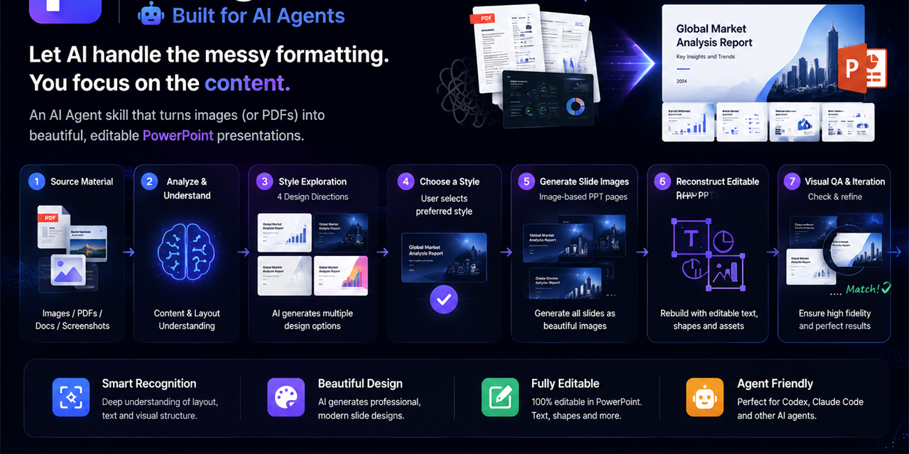
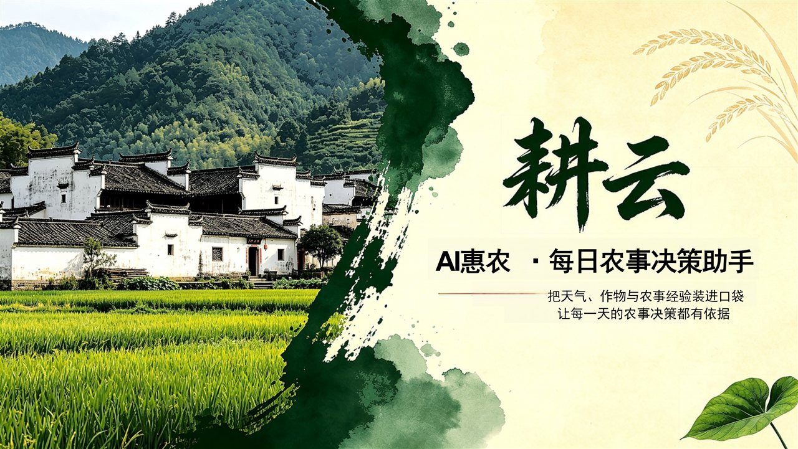

<p align="center">
  <a href="./README.md">简体中文</a> | <b>English</b>
</p>

# image-ppt

[](https://github.com/helloo1568/image-ppt)
[](./LICENSE)


An Agent Skill that turns books, PDFs, papers, reports, and Markdown into image-based or editable PowerPoint presentations.

The workflow is staged: understand the material, present four style thumbnails for selection, render the complete image-based deck, and restore editability only when the user explicitly requests it.



## Features

- Extract presentation structure, ideas, examples, and conclusions from long documents
- Generate four distinct style thumbnails before rendering the full deck
- Render page images with a consistent selected visual system
- Deterministically assemble ordered page images into a 16:9 PPTX
- Optionally restore major text, simple shapes, and charts as editable elements
- Persist requirements, page order, exact data, and per-page status for reliable resume

## Workflow

```text
Source material
  ↓
Requirement confirmation
  ↓
Content outline and four style thumbnails
  ↓ user selects a style
Image-based page rendering and PPTX assembly
  ↓ user explicitly requests editability
Editable PPTX restoration (optional)
```

The default workflow has two mandatory checkpoints:

1. Confirm source material, reference style, use case, and expected page count
2. Show four style thumbnails and wait for the user to select one

Users may explicitly say “skip the thumbnails,” “choose the style for me,” or “only create the image-based deck.” A normal “make a PPT” request does not authorize skipping checkpoints.

## What Is a Style Thumbnail?

A style thumbnail is not a scaled-down single slide, and the four styles are not combined into one 2x2 comparison image.

Each style thumbnail is one landscape image that resembles PowerPoint Slide Sorter view:

- One image represents one consistent design direction
- It contains 6–8 miniature 16:9 slides in a 3x2, 4x2, or similar grid
- The slides normally cover the title, key metrics, content, chart, case, and summary/action page types
- All four options use the same slide sequence and content
- Only the color system, typography, layout system, graphic language, and media style change
- The four images are shown separately and numbered 1–4 for selection

This lets users judge both individual page design and cross-slide consistency before full rendering begins.

## Installation

Clone the repository into the skill directory used by your Agent product. The exact directory may differ by product.

### Codex

```bash
git clone https://github.com/helloo1568/image-ppt.git ~/.codex/skills/image-ppt
```

### Claude Code

```bash
git clone https://github.com/helloo1568/image-ppt.git ~/.claude/skills/image-ppt
```

### Let the Agent install it

Paste this prompt to your Agent and it will handle cloning, verification, and dependencies:

```text
Install the image-ppt skill for me:
1. Clone https://github.com/helloo1568/image-ppt.git into the skill directory
2. Verify SKILL.md and references/prompts.md exist
3. Install dependencies from requirements.txt
4. Tell me when done
```

Verify that these files exist:

```text
image-ppt/SKILL.md
image-ppt/references/prompts.md
```

Install dependencies when using the image assembly script:

```bash
python -m pip install -r requirements.txt
```

## Quick Start

Provide the material, use case, and expected page count:

```text
Use image-ppt to turn this PDF into a 12-slide classroom presentation.
I have no reference template. Generate four Slide Sorter-style thumbnails first and wait for my choice.
```

More examples:

```text
Turn this book into a 15-slide book-sharing deck with no reference style.
Turn this weekly report into an image-based meeting deck; do not restore editability.
Start from this existing image deck and only perform editable restoration.
Skip the style thumbnails and choose an appropriate executive-report style for me.
```

## Examples

Real PPT pages generated with this skill:

**Gengyun — AI AgriTech Competition PPT** (Neo-Chinese ink-wash style)



**Wanqing Weekly Report** (same content, two style variants)

| Style B: Navy-gold corporate | Style C: Neo-Chinese green-gold |
|:---:|:---:|
|  |  |

**Silver Emotion Account Proposal** (Vintage warm-orange style)


> More examples in the `examples/` directory.

## Outputs

Depending on the authorized workflow stage, the skill can produce:

- Four separate Slide Sorter-style thumbnail images
- Ordered PNG/JPEG page images
- An image-based `.pptx` with one full-page image per slide
- A hybrid `.pptx` with major information restored as editable elements (optional)
- A temporary `deck-spec.md` used for state and task recovery

## Deterministic PPTX Assembly

`scripts/build_image_ppt.py` naturally sorts PNG/JPEG files and assembles them into a PPTX:

```bash
python scripts/build_image_ppt.py ./slides ./output/deck.pptx
```

Use zero-padded filenames:

```text
01-cover.png
02-dashboard.png
03-analysis.png
```

Common options:

```bash
python scripts/build_image_ppt.py ./slides ./deck.pptx --fit cover
python scripts/build_image_ppt.py ./slides ./deck.pptx --fit contain --background FFFFFF
```

The script creates 16:9 slides by default, reopens the saved file, and verifies the slide count. It requires Python, Pillow, and python-pptx.

## Repository Layout

```text
image-ppt/
├── SKILL.md
├── README.md
├── README.en.md
├── LICENSE
├── manifest.yaml
├── requirements.txt
├── .gitignore
├── agents/
│   └── openai.yaml
├── references/
│   ├── prompts.md
│   └── deck-spec-template.md
├── scripts/
│   └── build_image_ppt.py
├── examples/
│   ├── gengyun-cover.jpg         ← AgriTech PPT (ink-wash style)
│   ├── wanqing-weekly-b-cover.jpg ← Weekly report Style B (corporate)
│   ├── wanqing-weekly-c-p1.jpg    ← Weekly report Style C (Neo-Chinese)
│   ├── wanqing-weekly-c-p2.jpg
│   ├── wanqing-weekly-c-p4.jpg
│   ├── silver-emotion-p1.jpg      ← Emotion account proposal (vintage)
│   └── silver-emotion-p2.jpg
├── social-preview.jpg
└── social-preview.png
```

## Platforms and Tools

The skill is not tied to one image model. It works best in an Agent environment that can:

- Read PDFs, Markdown, and long-form text
- Call an image-generation model
- Run local scripts and write files
- Inspect generated images and PPTX files

Codex can handle document reading, workflow orchestration, and PPTX assembly. Page images may be generated with GPT Image, Agnes, Midjourney, or another available model. When an external generator cannot use an image reference, convert the selected thumbnail into a stable text-based visual specification and reuse it on every page.

## Limitations

- Image models may produce incorrect text, numbers, or inconsistent cross-slide styling; every page requires validation
- Image-based slide contents are not directly editable
- Editable restoration uses a hybrid “visual fidelity + editable information” strategy and cannot guarantee that every element becomes native PowerPoint content
- Dense tables and calculation-sensitive charts are better produced programmatically
- File capabilities, size limits, pricing, and content policies vary across Agent platforms and image providers

## Security and Privacy

- The repository contains no API keys or account credentials
- `build_image_ppt.py` reads local images and writes a local PPTX without network requests
- External document or image services may upload prompts, source material, or page content; review the provider’s privacy policy
- Never commit credential-bearing `config.json` files, environment files, or private source materials

## Contributing

Issues and pull requests are welcome. Before submitting a change:

1. Keep `SKILL.md` concise and place long prompts or templates under `references/`
2. Do not add API keys, generated caches, or user source material
3. Run `python -m py_compile scripts/build_image_ppt.py`
4. Test requirement gating, four-thumbnail selection, and PPTX assembly with at least one realistic document
5. Update both Chinese and English READMEs

## Credits

The early workflow was inspired by:

- The Xiaoheihe tutorial “Youth Study AI Edition: Creating Beautiful Editable PPTs with GPT 5.6,” by 玩家22186848
- Academic presentation workflows shared by Bilibili creator 一往无前河井

Thanks to the original authors and community contributors for sharing their methods and experience.

## License

[MIT License](./LICENSE) © 2026 风清云影 (helloo1568)
