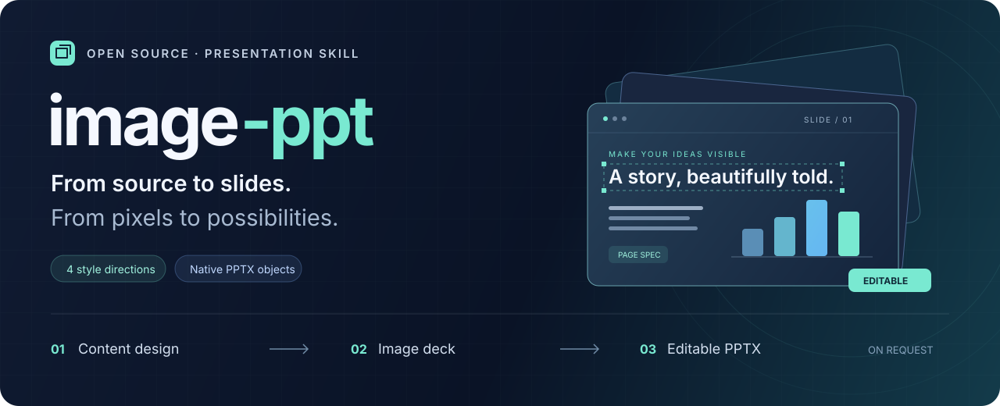
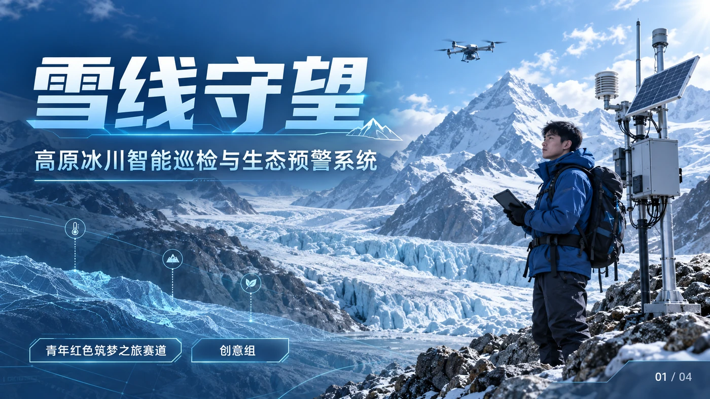
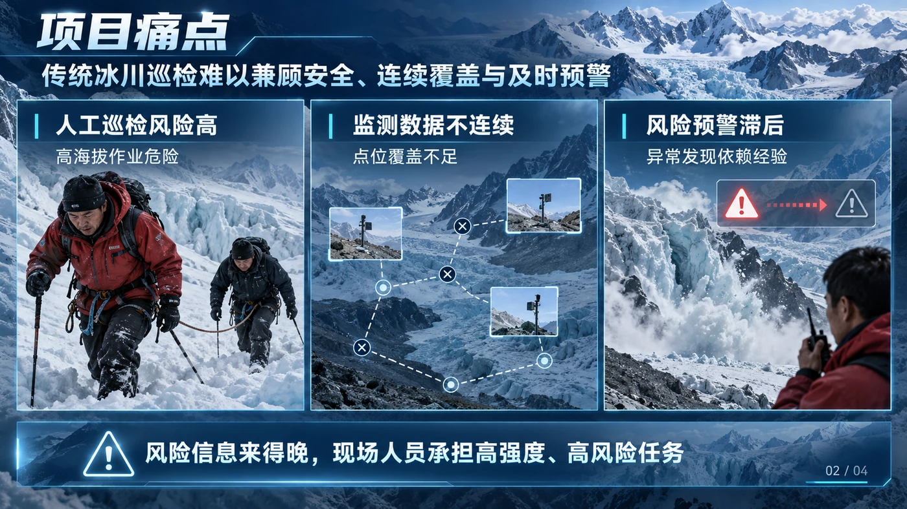
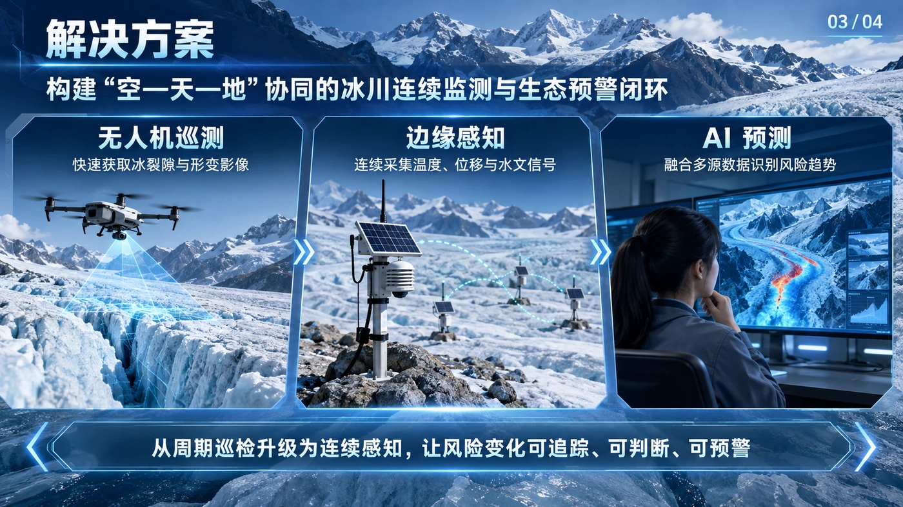
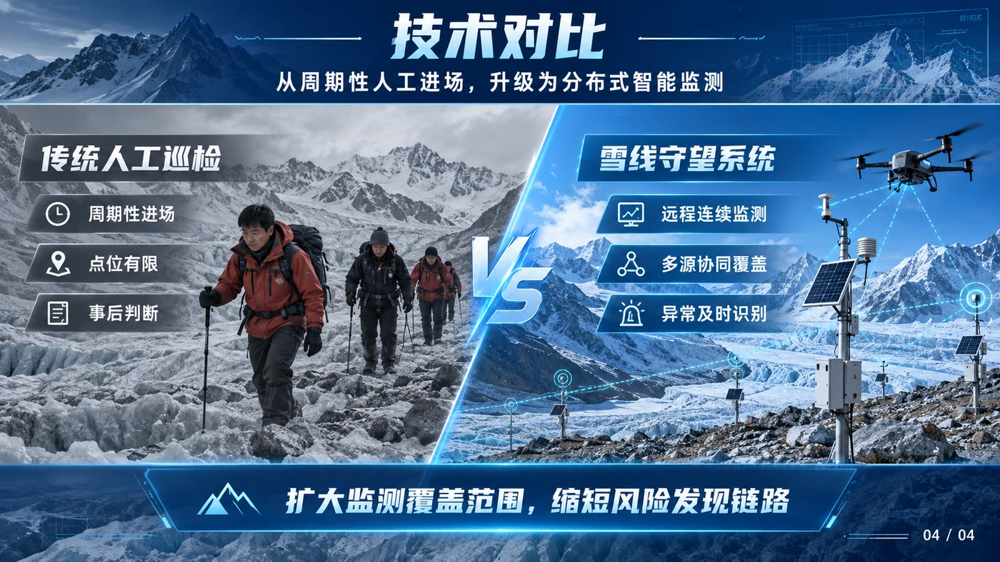
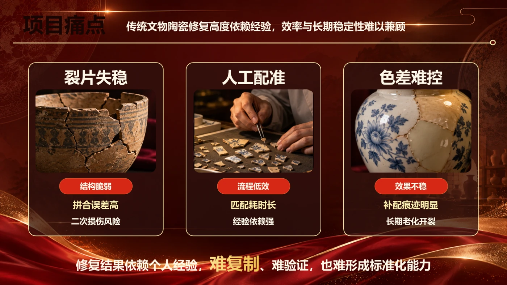

<div align="center">



# SlideMuse · 视觉优先的 AI PPT 技能

**先把 PPT 做得值得展示，再让它可编辑。**

将书籍、PDF、论文与报告变成风格统一的图片 PPT，按需继续还原为原生可编辑 PPTX。<br>
重点面向**挑战杯（大挑/小挑）、中国国际大学生创新大赛、全国大学生交通运输科技大赛（交科赛）、三创赛、正大杯、大创等竞赛**，也适用于**学术汇报、论文答辩、项目路演、课程展示与电影质感 PPT**，支持图片转可编辑 PPT。

[](https://github.com/helloo1568/slidemuse/actions/workflows/ci.yml)
[](CHANGELOG.md)
[](requirements.txt)
[](LICENSE)

**简体中文** · [English](README.en.md)

[作品展示](#showcase) · [核心优势](#features) · [快速开始](#quick-start) · [使用指南](docs/guide.md) · [参与贡献](CONTRIBUTING.md)

</div>

## 30 秒安装

**推荐：直接把这一句话发给 Codex / Claude Code / OpenCode：**

```text
安装 SlideMuse，仓库是 https://github.com/helloo1568/slidemuse 。
请运行仓库自带的 install.py，自动注册 Skill、安装隔离依赖并完成自检。
```

安装后直接说：`使用 $slidemuse，把这份 PDF 做成 10 页竞赛 PPT。`

手动安装也只需：

```sh
git clone https://github.com/helloo1568/slidemuse.git slidemuse
python slidemuse/install.py
```

---

<a id="showcase"></a>

## 先看作品

同一套工作流，两种视觉表达。以下为本项目工作流产出的实际页面，点击图片可查看原图。

### 雪线守望 · 冰川蓝银科技

高原冰川智能巡检与生态预警系统：以冷色科技视觉串联项目叙事、场景与技术对比，展示科技风竞赛 PPT 与电影质感 PPT 的视觉方向。

#### 01 / 项目封面

<a href="showcase/snowline-watch-01.png"></a>

#### 02 / 项目痛点

<a href="showcase/snowline-watch-02.png"></a>

#### 03 / 解决方案

<a href="showcase/snowline-watch-03.png"></a>

#### 04 / 技术对比

<a href="showcase/snowline-watch-04.png"></a>

### 釉光新生 · 红金竞赛风格

用红金配色呈现工艺主题，让痛点、方案和技术信息保持一致的视觉语言，为国赛 PPT、比赛答辩 PPT 和创新创业路演提供风格参考。

#### 02 / 项目痛点

<a href="showcase/red-gold-competition-02.png"></a>

#### 03 / 解决方案

<a href="showcase/red-gold-competition-03.png"></a>

#### 04 / 工艺技术

<a href="showcase/red-gold-competition-04.png"></a>

<sub>作品图用于展示视觉效果；可编辑性以实际 PPTX 对象与审查报告为准。案例中的业务与技术数据属于演示内容，不代表本技能的性能指标。</sub>

<a id="features"></a>

## 为什么选择 SlideMuse

| | 带给你的价值 |
| :--- | :--- |
| **🎨 先选风格，再做整套** | 内容大纲确认后，用同一组内容生成 **4 套幻灯片浏览视图**。先看到整体方向，再逐页制作。 |
| **🧩 好看，也能继续改** | 按需还原为原生文本、形状、表格与 **5 类图表**；照片和复杂插画拆成独立图片，便于替换和复用。 |
| **📝 准确内容，有据可循** | **Page Spec** 同步保存确认过的文字、数字、来源与元素 ID。还原时直接复用已知内容，减少重新识别和猜测。 |
| **🔁 修改有记录，任务可接续** | `deck-spec.md` 保存制作状态，`scene.json` 保存布局。局部修改针对受影响的元素与素材，可重新导出。 |
| **🔍 交付有检查依据** | 脚本检查原生对象、文字、表格与图表数据、层级及整页底图残留，再配合逐页渲染核对。 |
| **🔓 开放、可迁移、可扩展** | **MIT 开源**，兼容具备所需能力的 Agent；本地 Python 工具不发起网络请求，也不需要 API Key。 |

> **运行方式：** SlideMuse 是 Agent 技能。宿主负责读材料、视觉理解与生图；仓库脚本负责合并、裁剪、编译和审查。完整制作需要宿主具备相应能力。模型选择参见[运行环境与模型说明](references/models.md)。

## 适合制作哪些 PPT

| 场景与风格 | 如何使用 SlideMuse |
| :--- | :--- |
| **竞赛 PPT / 比赛答辩 PPT / 国赛 PPT** | 围绕项目痛点、解决方案、技术优势与应用价值组织叙事，统一整套竞赛演示的视觉风格。 |
| **挑战杯 / 创新大赛 / 交科赛 / 三创赛 / 正大杯 / 大创** | 将项目书、论文、调研报告、商业计划书或赛事要求转成竞赛答辩页面，围绕评审逻辑组织内容并统一视觉表达。 |
| **电影质感 PPT / 电影感 PPT / 海报风 PPT** | 将电影感光影、场景构图和海报式封面作为风格方向，在四套总览中比较后选定。 |
| **学术汇报 PPT / 论文答辩 PPT / 组会 PPT** | 从论文、PDF 和研究报告提炼问题、方法、结果与结论，保留准确数据与来源。 |
| **商业路演 PPT / 项目汇报 PPT / 课程展示 / 读书分享 PPT** | 根据受众和页数梳理内容，把长材料转成适合演讲和展示的页面。 |
| **AI PPT 生成 / PDF 转 PPT / 图片转可编辑 PPT** | 从材料生成图片版，或从已有页面图片、扫描 PDF 开始，按需还原原生可编辑 PPTX。 |

电影质感、科技风、红金风等属于可指定的视觉方向；实际效果取决于素材、宿主生图能力和逐页审校。

### 重点竞赛：挑战杯、大学生创新大赛、交科赛、三创赛、正大杯、大创

准备以下赛事的路演或答辩时，可以把项目书、论文、调研报告和赛事要求一起交给 SlideMuse。下表提供内容组织思路，制作大纲以当届通知和赛道要求为准。

| 赛事名称 | 常见搜索词 | 可组织的汇报内容 |
| :--- | :--- | :--- |
| [中国国际大学生创新大赛](https://hudong.moe.gov.cn/srcsite/A08/s5672/202607/t20260731_1445670.html) | **大学生创新大赛 PPT / 互联网+ PPT / 创新创业大赛 PPT** | 项目痛点、创新方案、应用验证、团队与发展规划。 |
| [“挑战杯”全国大学生课外学术科技作品竞赛](https://www.tiaozhanbei.net/focus) | **挑战杯 PPT / 大挑 PPT / 科技作品答辩 PPT** | 研究问题、技术方法、创新点、实验结果与应用价值。 |
| [“挑战杯”中国大学生创业计划竞赛](https://www.tiaozhanbei.net/focus) | **小挑 PPT / 挑战杯创业计划 PPT / 创业计划书路演** | 用户需求、产品方案、市场分析、商业模式与实施计划。 |
| [全国大学生交通运输科技大赛（交科赛）](http://www.nactrans.net/) | **交科赛 PPT / 交通运输科技大赛 PPT / 交通科技竞赛答辩** | 交通问题、方案设计、技术路线、实验或应用验证与创新价值。 |
| [全国大学生电子商务“创新、创意及创业”挑战赛](https://www.3chuang.net/) | **三创赛 PPT / 电商三创赛 PPT / 三创赛答辩** | 电商场景、创意方案、运营实践、项目成果与商业价值。 |
| [“正大杯”全国大学生市场调查与分析大赛](https://www.china-cssc.org/show-568-1912-1.html) | **正大杯 PPT / 市调大赛 PPT / 市场调查与分析大赛 PPT** | 调研问题、调查设计、数据分析、主要发现与建议。 |

也适合**大学生创新创业训练计划（大创）立项答辩、中期汇报与结题答辩 PPT**。大创在这里作为项目汇报场景单列。

## 从材料到交付，三步完成

| 01 · 内容与风格 | 02 · 图片版 PPT | 03 · 可编辑还原（按需） |
| :--- | :--- | :--- |
| 提炼材料，确认逐页大纲 | 保存 Page Spec，逐页生成 | 结合规格与页面图分层重建 |
| 四套总览，选定视觉方向 | 检查文字与视觉，合并 PPTX | 编译原生对象，审查并渲染核对 |
| **得到：确认后的制作方案** | **得到：页面图片 + 图片版 PPTX** | **得到：可编辑 PPTX + Scene + 素材** |

默认先确认内容，再选择风格。仅在明确要求可编辑版时进入第三步；已有幻灯片图片或扫描 PDF 的还原任务可直接从第三步开始。跳过预览、代选等规则见[完整流程](docs/guide.md)。

<a id="quick-start"></a>

## 快速开始

### 1. 推荐：直接让 Agent 安装

需要 **Python 3.10+**，以及支持技能文件、材料读取、图像生成和本地文件操作的 Agent。

把下面这句话发给你的 Codex、Claude Code 或其他支持技能的 Agent：

```text
安装 SlideMuse 这个 skill，地址是 https://github.com/helloo1568/slidemuse 。
请使用仓库自带的 install.py 完成注册、依赖安装和自检。
```

### 2. 手动安装：clone 后只运行一条命令

```sh
git clone https://github.com/helloo1568/slidemuse.git slidemuse
python slidemuse/install.py
```

安装器会自动识别 Codex / Claude Code / OpenCode，复制最小运行文件、创建隔离的 Python 环境、安装依赖，并运行 Page Spec 自检。需要指定客户端时：

```sh
python slidemuse/install.py --client codex
python slidemuse/install.py --client claude
python slidemuse/install.py --client opencode
```

安装完成后，材料与产物仍应保存在独立工作目录，不要放进技能安装目录。

### 3. 附上材料，复制这段话

```text
使用 $slidemuse，把附件报告做成 10 页项目路演 PPT。
受众是比赛评委，没有指定参考风格。
先给我内容大纲，确认后再展示四套幻灯片浏览视图供我选择。
选定风格后生成图片版，再继续还原为可编辑 PPTX。
请一并交付 page-spec.json、scene.json、素材和审查报告。
```

<details>
<summary>更多用法：只做图片版 / 还原已有页面</summary>

**课堂或读书分享，只需要图片版：**

```text
使用 $slidemuse，把附件材料做成 12 页课堂汇报 PPT，受众是同学。
没有参考风格，只需要图片版。先确认内容大纲，再给我四套总览选型。
```

**已有图片，想继续修改：**

```text
使用 $slidemuse，从 Step 3 开始，把附件的全部幻灯片图片还原为可编辑 PPTX。
保持原始文字、比例、布局与页序，拆出文字、图表和需要修改的主体。
复杂插画保留为独立图片，清理背景残影，并交付 Scene、素材和审查报告。
```

</details>

## “可编辑”具体能改什么

| 页面内容 | 还原后的对象 | 可以修改 |
| :--- | :--- | :--- |
| 标题、正文、标签、页码 | 原生文本框 | 文字、字体、颜色、位置 |
| 几何形状、箭头、流程节点 | 原生形状、线条、组合 | 尺寸、样式，取消组合后分别编辑 |
| 表格 | 原生表格 | 单元格内容与格式 |
| 柱形、条形、折线、饼图、环形图 | 原生图表 + 内嵌数据工作簿 | 数据、图表样式 |
| 照片、人物、复杂插画 | 独立图片对象 | 移动、缩放、裁剪、替换 |

复杂插画内部仍是像素。识别、分层和背景补全依赖宿主工具；本地脚本不包含自动 OCR 或分割模型。结构审查不能代替视觉验收，不能保证恢复被遮挡的信息。详见[能力边界与验收](docs/guide.md)。

## 文档与社区

| 想做什么 | 从这里开始 |
| :--- | :--- |
| 了解安装、流程、命令与验收 | [使用与技术指南](docs/guide.md) |
| 让 Agent 执行技能 | [SKILL.md](SKILL.md) |
| 扩展内容规格与可编辑对象 | [Page Spec](references/page-spec.md) · [Scene v1](references/scene-format.md) · [重建指南](references/reconstruction.md) |
| 查看版本变化与设计来源 | [Changelog](CHANGELOG.md) · [调研记录](references/research.md) |
| 反馈问题、提建议或贡献代码 | [Issues](https://github.com/helloo1568/slidemuse/issues) · [贡献指南](CONTRIBUTING.md) |

### 致谢与许可

感谢 [Hugo He 的 PPT Master](https://github.com/hugohe3/ppt-master)、[banana-slides](https://github.com/Anionex/banana-slides) 和 [PPTAgent](https://github.com/icip-cas/PPTAgent) 带来的方法启发，以及小黑盒作者“玩家22186848”和 B 站 UP 主“一往无前河井”的教程分享。场景编译器为独立实现，来源与取舍见[调研记录](references/research.md)。

本地脚本无需 API Key；宿主生图与视觉服务可能接收所提供的材料，费用与隐私规则以宿主为准。

<div align="center">

**让下一次汇报，从好内容开始。**

如果这个技能对你有帮助，欢迎 Star，也欢迎分享你的作品与改进。

[MIT License](LICENSE) © 2026 风清云影（[helloo1568](https://github.com/helloo1568)）

</div>
