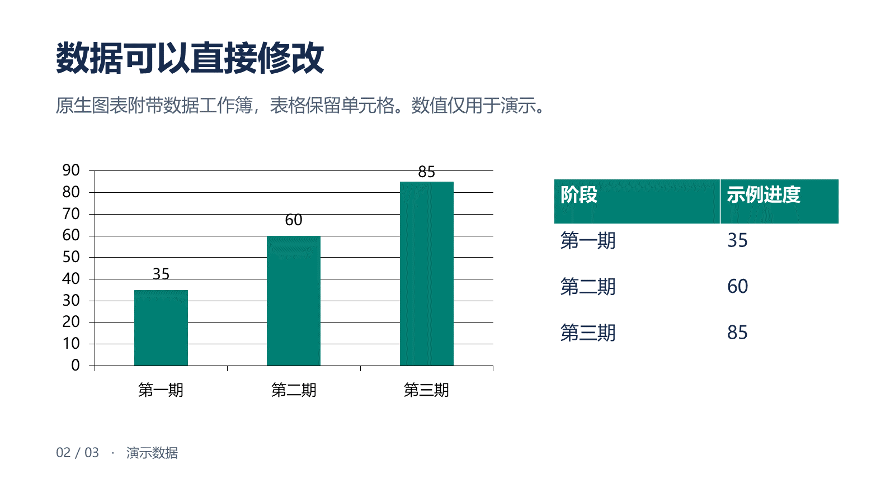

# 图片 PPT · image-ppt

**用 GPT Image 2.5 创造视觉，把文字、图形、表格和图表交付为可编辑 PowerPoint 对象。**

[English](README.en.md) · [技能入口](SKILL.md) · [更新记录](CHANGELOG.md) · [方法调研](references/research.md)

image-ppt 是运行在 Codex 等 Agent 环境中的开源技能。Agent 负责读材料、看图识别和生图，本地脚本负责确定性导出与检查。

## 2.0 有什么变化

- **编辑优先**：新 PPT 先规划原生信息层，再生成无字背景与独立素材。
- **图片重建**：识别文字、几何、图片及遮挡，重建为有稳定 ID 的元素。
- **原生导出**：文本、形状、箭头、嵌套组合、表格和五类图表；图表带内嵌数据工作簿。
- **分层素材**：按指定坐标/遮罩输出 PNG，保留来源和哈希；照片、人物和插画可单独移动或替换。
- **可复现修改**：scene.json 保存布局与内容，修改指定元素后直接重新导出。
- **验收工具**：检查导出对象、文字、表格数据、图表数据、层级和原始整页底图残留。
- **GPT Image 2.5 指南**：Flare 用于快速探索，Sunburst 用于精确参考编辑；依照宿主实际能力选择。
- 保留图片版 PPT、文字叠加和四套风格比较能力；只在用户要求选型时等待确认。

模型资料：[OpenAI 图像生成指南](https://developers.openai.com/api/docs/guides/image-generation)。
推荐策略不是已运行的性能基准，也不保证你的宿主暴露具体型号。

## “每个元素可编辑”是什么意思

| 元素 | 输出形式 | 可以修改 |
|---|---|---|
| 标题、正文、标签、页码 | 原生文本框 | 文案、字体、颜色、位置 |
| 几何形状、箭头、流程节点 | 原生形状 / 组合 | 尺寸、样式，取消组合分别编辑 |
| 表格 | 原生表格 | 单元格内容与格式 |
| 柱形、条形、折线、饼图、环形图 | 原生图表 + 工作簿 | 数据与图表格式 |
| 照片、人物、复杂插画 | 独立图片对象 | 移动、缩放、裁剪、替换 |

复杂插画内部仍是像素；被遮挡的信息也不能凭空准确恢复。
**本地脚本不包含自动 OCR、分割模型或端到端图片理解。** 识别与必要的背景补全由宿主 Agent/视觉工具完成。
不能把整页截图加几个文本框称作全部可编辑，也不能把 SVG 图片嵌入等同于原生导出。

## 快速开始

Python 3.10+。克隆或下载项目：

```sh
git clone https://github.com/helloo1568/image-ppt.git
cd image-ppt
python -m pip install -r requirements.txt
```

把这个项目目录作为 image-ppt 技能交给支持 SKILL.md 的 Agent，或把完整目录安装到该宿主的技能目录。
技能执行时把用户材料和产物放在独立工作目录。

### 零 API 的功能示例

```sh
python scripts/build_editable_ppt.py examples/editable-scene.example.json output/editable-demo.pptx
python scripts/audit_editability.py output/editable-demo.pptx --scene examples/editable-scene.example.json --output output/editability.json --strict
```

[下载三页可编辑示例](examples/editable-demo.pptx) · [查看场景 JSON](examples/editable-scene.example.json)

示例使用明确编写的场景与历史图片素材，测试导出能力，不是图片自动识别准确率展示。
数据页的数字全部为演示数据。



### 对 Agent 说

```text
使用 $image-ppt 把这份报告做成 10 页可编辑 PPT。
标题、正文、流程图、表格和有可靠数据的图表都用原生对象；
视觉素材用 GPT Image 2.5，人物与插画分别保留为可移动图片。
你自行选择合适风格，先检查一页代表性样张，再完成全稿。
```

```text
使用 $image-ppt 将这些幻灯片图片还原成可编辑 PPTX。
保持原始文字、布局与页序，把所有需要修改的元素独立拆出。
复杂插画保留为单独图片，清理背景残影，并交付 scene.json 和素材。
```

```text
只做图片版 PPT。先展示四套使用同一组内容的风格总览，等我选择。
```

## 三条路线

1. **编辑优先**：材料 → 内容与版面 → 无字视觉/独立素材 → scene.json → 原生 PPTX → 验收。
2. **图片优先**：材料 → 风格与逐页生图 → 图片版 PPTX。适合仅需展示的用户。
3. **图片重建**：规范逐页输入 → Agent 识别元素 → 背景清理/主体分离 → scene.json → 原生 PPTX → 逐页对照。

没有源文件或关键事实不明确时需要补充信息；一般风格和页数允许结合上下文推断。
用户明确要求选择风格时才等待选择，不再对普通请求强制执行多轮门禁。

## 工具

| 脚本 | 作用 |
|---|---|
| scripts/build_editable_ppt.py | 从 scene.json 构建原生对象并原子替换输出 |
| scripts/audit_editability.py | 复查导出的 PPTX，可选与 scene 比较，导出报告 |
| scripts/extract_assets.py | 根据已知 bbox 和可选灰度遮罩裁剪素材 |
| scripts/build_image_ppt.py | 兼容旧版：自然排序图片、拼装图片版 PPTX |
| scripts/overlay_text.py | 兼容旧版：将准确文字栅格叠加到背景 |

```sh
python scripts/extract_assets.py work/extract.json work/assets/slide-01
python scripts/build_image_ppt.py work/slides output/image-deck.pptx --fit contain
python scripts/overlay_text.py work/overlay.json
```

坐标、路径、支持字段与局部修改见 [场景协议](references/scene-format.md)；
overlay.json 可参考 examples/overlay-spec.example.json，先填入实际背景路径；该旧版规格是模板，背景图未随仓库提供。
遮挡、透明度、背景清理见 [重建指南](references/reconstruction.md)。
本版不提供通用 SVG 导入、合并表格单元格、自动吸附连线或富文本段内样式。

## 验证

```sh
python -m pip install -r requirements-dev.txt
python -m ruff check .
python -m pytest tests/ -q
```

CI 覆盖 Windows / Linux、Python 3.10 / 3.12 / 3.13。
结构检查验证声明的场景对象，不能证明没有漏识别元素，也不代替 PowerPoint 渲染。
交付前逐页检查中文换行、字体、图表标签、图片边缘和移动后的残影。
示例已由 PowerPoint 导出预览；自动测试不依赖 PowerPoint。

## 历史视觉示例

以下图片保留自旧版，展示生图视觉方向，不代表逐元素还原结果。

| 项目周报 | 中老年情感方案 |
|---|---|
|  |  |

## 来源与取舍

本次重点参考 [Hugo He 的 PPT Master](https://github.com/hugohe3/ppt-master) 的原生导出与图片分层思路，
并调研 [banana-slides](https://github.com/Anionex/banana-slides) 和 [PPTAgent](https://github.com/icip-cas/PPTAgent)。
本版独立实现 JSON 场景编译器，没有复制这些项目的源码或捆绑其依赖。
完整来源和能力边界见 [调研记录](references/research.md)。

早期工作流参考小黑盒作者“玩家22186848”的教程《青年大学习AI版：零基础用GPT5.6做精美可编辑PPT》，
以及 B 站 UP 主“一往无前河井”的学术 PPT 制作思路。感谢原作者与社区。

## 隐私与许可

本地脚本不发起网络请求，不需要 API Key。实际生图/视觉分析由宿主服务执行，可能上传对应材料。
公开产物前排除私人材料与凭证，保留需要分发的 scene 和素材。

[MIT License](LICENSE) © 2026 风清云影（helloo1568）
