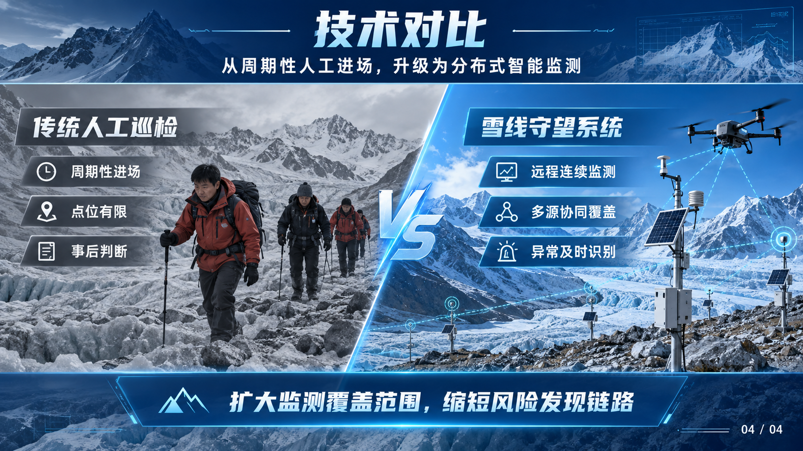

# 图片 PPT · image-ppt

**将书籍、PDF、报告和文字材料，严格按“内容提炼 → 图片 PPT 生成 → 可编辑 PPTX 还原”三步制作成专业演示文稿。**

> **最佳推荐：Codex + GPT Image 2.5。** 在 Codex 提供型号选择时，使用 GPT Image 2.5 Flare 快速探索风格，使用 GPT Image 2.5 Sunburst 生成成品和执行精确参考编辑。也可在其他 Agent 中使用；运行时调用该 Agent 自身的图像生成/编辑能力。

[English](README.en.md) · [技能入口](SKILL.md) · [更新记录](CHANGELOG.md) · [方法调研](references/research.md)

## 作品展示

以下页面来自按本项目工作流制作的实际案例。图片直接保存在仓库中，便于在 GitHub 首页预览视觉完成度。

### 雪线守望 · 高原冰川智能巡检与生态预警系统

| 封面 | 项目痛点 |
|---|---|
|  |  |

| 解决方案 | 技术对比 |
|---|---|
|  |  |

### 釉光新生 · 红金国赛风格

| 项目痛点 | 解决方案 |
|---|---|
|  |  |


image-ppt 是运行在 Codex 等 Agent 环境中的开源技能。宿主 Agent 负责读取材料、视觉识别和调用自身生图能力；本地脚本只负责确定性合并、Scene v1 编译、素材裁剪和结果审查，不内置生图模型或自动调用收费 API。

GPT Image 2.5 的官方定位中，Sunburst 面向高精度生成与编辑，Flare 面向快速、高质量的日常生成。这里的“最佳推荐”是本项目针对该工作流的组合建议，不是跨平台基准结论；如果 Codex 或其他 Agent 不暴露具体型号，应使用它实际提供的生图能力并如实记录后端。参见 [OpenAI 图像模型](https://developers.openai.com/api/docs/models) 和 [GPT Image 2.5 Flare](https://developers.openai.com/api/docs/models/gpt-image-2.5-flare)。

## 2.1.0 的流程契约

- **唯一主流程**：新材料必须先形成内容方案和图片版，再按明确授权进入可编辑还原；不另起“编辑优先”捷径。
- **双确认门禁**：先单独确认内容大纲，再进入四套幻灯片浏览视图选型；内容未确认不得消耗生图资源。
- **确定的风格豁免**：只有明确要求严格沿用指定模板、跳过预览或授权代选时按规则快进，不能由 Agent 自行判断。
- **Page Spec 中间层**：图片生成时同步保存准确文字、数据、来源、稳定 ID 与结构意图，避免可编辑还原时重新 OCR 和猜测。
- **显式快进**：只有“跳过预览”“你代选”“缺失项由你决定”等明确指令可跳过对应门禁，普通的“帮我做 PPT”不算授权。
- **图片重建**：识别文字、几何、图片及遮挡，重建为有稳定 ID 的元素。
- **原生导出**：文本、形状、箭头、嵌套组合、表格和五类图表；图表带内嵌数据工作簿。
- **分层素材**：按指定坐标/遮罩输出 PNG，保留来源和哈希；照片、人物和插画可单独移动或替换。
- **可复现修改**：scene.json 保存布局与内容，修改指定元素后直接重新导出。
- **验收工具**：检查导出对象、文字、表格数据、图表数据、层级和原始整页底图残留。
- **GPT Image 2.5 指南**：Flare 用于快速探索，Sunburst 用于精确参考编辑；依照宿主实际能力选择。
- **恢复与局部修改**：`deck-spec.md` 保存状态与授权，`scene.json` 保存可编辑页面；新指令只使受影响的选择和产物失效。

模型资料：[OpenAI 图像生成指南](https://developers.openai.com/api/docs/guides/image-generation)。

## “每个元素可编辑”是什么意思

| 元素 | 输出形式 | 可以修改 |
|---|---|---|
| 标题、正文、标签、页码 | 原生文本框 | 文案、字体、颜色、位置 |
| 几何形状、箭头、流程节点 | 原生形状 / 组合 | 尺寸、样式，取消组合分别编辑 |
| 表格 | 原生表格 | 单元格内容与格式 |
| 柱形、条形、折线、饼图、环形图 | 原生图表 + 工作簿 | 数据与图表格式 |
| 照片、人物、复杂插画 | 独立图片对象 | 移动、缩放、裁剪、替换 |

复杂插画内部仍是像素；被遮挡的信息也不能凭空准确恢复。
**本地脚本不包含自动 OCR、分割模型或端到端图片理解。** 识别与必要的背景补全由宿主 Agent/视觉工具完成。
不能把整页截图加几个文本框称作全部可编辑，也不能把 SVG 图片嵌入等同于原生导出。

## 快速开始

Python 3.10+。克隆或下载项目：

```sh
git clone https://github.com/helloo1568/image-ppt.git
cd image-ppt
python -m pip install -r requirements.txt
python scripts/validate_page_spec.py examples/page-spec.example.json --strict
```

把这个项目目录作为 image-ppt 技能交给支持 SKILL.md 的 Agent，或把完整目录安装到该宿主的技能目录。
在 Codex 中由 Codex 调用其图像生成能力；在其他 Agent 中由对应 Agent 调用其原生/已连接的生图能力。技能执行时把用户材料和产物放在独立工作目录。

## 运行环境

| 环境 | 生图方式 | 说明 |
|---|---|---|
| Codex（最佳推荐） | 调用 Codex 图像生成能力；可选型号时优先 GPT Image 2.5 | Flare 用于方案探索，Sunburst 用于成品与精确编辑 |
| 其他 Agent | 调用该 Agent 自身提供或已连接的图像生成/编辑能力 | 保持同一状态机、提示词和验收标准 |
| 仅 Python 环境 | 不支持端到端生图 | 只能运行图片合并、文字叠加、Scene 编译、素材裁剪和审查脚本 |

本技能不会替其他 Agent 安装生图插件、寻找 API Key 或静默切换外部服务。若当前 Agent 没有生图能力，应明确停在对应阶段。

### 对 Agent 说

```text
使用 $image-ppt 把这份报告做成 10 页可编辑 PPT。
用于项目路演，没有指定参考风格。先展示内容大纲等我确认，再给我四套幻灯片浏览视图；选定后生成图片版和 page-spec.json，再继续还原可编辑版。
```

```text
使用 $image-ppt 从现有图片开始执行 Step 3，将这些幻灯片还原成可编辑 PPTX。
保持原始文字、布局与页序，把所有需要修改的元素独立拆出。
复杂插画保留为单独图片，清理背景残影，并交付 scene.json 和素材。
```

```text
只做图片版 PPT。用于课堂汇报，共 12 页；没有参考风格。先展示四套使用同一组内容的幻灯片浏览视图，等我选择。
```

## 唯一三步流程

```text
确认源材料、参考风格、场景/受众、页数、交付范围
  ↓
Step 1A 内容提炼 → 等待用户确认大纲
  ↓
Step 1B 四套幻灯片浏览视图 → 等待用户选择
  ↓（严格沿用参考/跳过预览/代选按明确授权处理）
Step 2  page-spec.json → 逐页生成并验收图片 → 图片版 PPTX
  ↓ 仅在用户明确要求可编辑版时
Step 3  Page Spec + 页面图片 → scene.json → 原生可编辑 PPTX → 结构与视觉验收
```

普通任务表达不能跳过门禁。用户可以明确授权代定缺失项、代选风格或跳过四套预览；授权按最小范围解释。
如果输入本身就是页面图片或扫描版 PDF，且目标是还原可编辑 PPTX，可以直接从 Step 3 开始。已有可编辑 PPTX 的普通修改不使用本技能重做。

## 工具

| 脚本 | 作用 |
|---|---|
| scripts/validate_page_spec.py | 验证内容确认、连续页序、稳定 ID、位置提示和页面图片交付状态 |
| scripts/build_editable_ppt.py | 从 scene.json 构建原生对象并原子替换输出 |
| scripts/audit_editability.py | 复查导出的 PPTX，可选与 scene 比较，导出报告 |
| scripts/extract_assets.py | 根据已知 bbox 和可选灰度遮罩裁剪素材 |
| scripts/build_image_ppt.py | 兼容旧版：自然排序图片、拼装图片版 PPTX |
| scripts/overlay_text.py | 兼容旧版：将准确文字栅格叠加到背景 |

```sh
python scripts/validate_page_spec.py work/page-spec.json --require-images --strict
python scripts/extract_assets.py work/extract.json work/assets/slide-01
python scripts/build_image_ppt.py work/slides output/image-deck.pptx --fit contain
python scripts/overlay_text.py work/overlay.json
```

图片生成与可编辑还原之间的语义契约见 [Page Spec](references/page-spec.md)，最终坐标、路径、支持字段与局部修改见 [场景协议](references/scene-format.md)；
overlay.json 可参考 examples/overlay-spec.example.json，先填入实际背景路径；该旧版规格是模板，背景图未随仓库提供。
遮挡、透明度、背景清理见 [重建指南](references/reconstruction.md)。
本版不提供通用 SVG 导入、合并表格单元格、自动吸附连线或富文本段内样式。

## 验证

```sh
python -m pip install -r requirements-dev.txt
python -m ruff check .
python -m pytest tests/ -q
```

CI 覆盖 Windows / Linux、Python 3.10 / 3.12 / 3.13。
结构检查验证声明的场景对象，不能证明没有漏识别元素，也不代替 PowerPoint 渲染。
交付前逐页检查中文换行、字体、图表标签、图片边缘和移动后的残影。
作品集图片保持源页面像素尺寸；自动测试不依赖 PowerPoint。

## 来源与取舍

本次重点参考 [Hugo He 的 PPT Master](https://github.com/hugohe3/ppt-master) 的原生导出与图片分层思路，
并调研 [banana-slides](https://github.com/Anionex/banana-slides) 和 [PPTAgent](https://github.com/icip-cas/PPTAgent)。
本版独立实现 JSON 场景编译器，没有复制这些项目的源码或捆绑其依赖。
完整来源和能力边界见 [调研记录](references/research.md)。

早期工作流参考小黑盒作者“玩家22186848”的教程《青年大学习AI版：零基础用GPT5.6做精美可编辑PPT》，
以及 B 站 UP 主“一往无前河井”的学术 PPT 制作思路。感谢原作者与社区。

## 隐私与许可

本地脚本不发起网络请求，不需要 API Key。实际生图/视觉分析由宿主服务执行，可能上传对应材料。
公开产物前排除私人材料与凭证，保留需要分发的 scene 和素材。

[MIT License](LICENSE) © 2026 风清云影（helloo1568）
